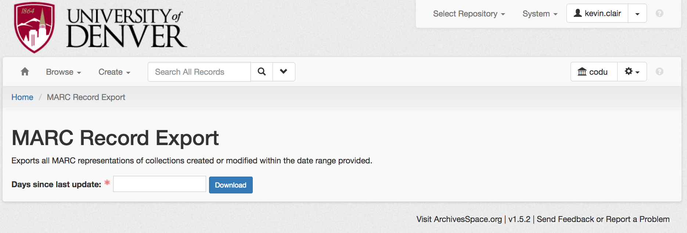

# MARC Record Export

Exports MARC records for all collections created or updated within the provided date range

# How to use it

The plugin may be found as "MARC Export" in the plugins menu. The view will look like this:

Enter the number of days you want the date range to cover; the plugin will then fetch the list of resources created and/or modified in the last $n days, then download the MARCXML representation of each. When finished, it will send a single MARCXML collection containing all of the records to save or open in your preferred XML editor.

If the value entered in the text field is not numerical (cannot be converted from string to integer or float), the plugin will throw an error and start over.

Questions: kevin.clair [at] du.edu.
